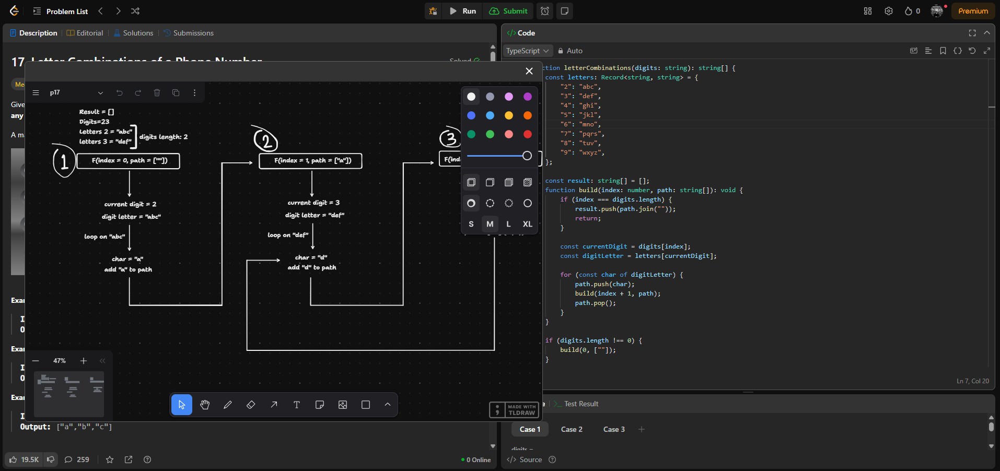

# ✏️ LeetCode Whiteboard – Chrome Extension



A whiteboard overlay for [LeetCode](https://leetcode.com) problem pages.  
Draw, write, and visualize your algorithm ideas without leaving the tab.  
Built with [tldraw](https://github.com/tldraw/tldraw).

---

## 🚀 Features

- 🖌️ Draw directly on LeetCode problems
- ✍️ Supports freehand drawing, shapes, text, and more
- 💾 Saves your whiteboard per problem
- ⚡ Quick and lightweight

---

## 📦 Installation

You can download the latest pre-built version from the [Releases](https://github.com/MiladSadeghi/leetcode-whiteboard/releases) section.

To install manually:

1. Download the `.zip` from the latest release
2. Unzip it
3. Go to `chrome://extensions/` in your browser
4. Enable **Developer mode**
5. Click **Load unpacked** and select the unzipped folder

---

## 🛠 For Developers

To build the extension from source:

```bash
pnpm install
pnpm build
```

The output will be in the `dist/` folder. You can then load it into Chrome as an unpacked extension.

## 🙌 Contributing

Pull requests and suggestions are welcome!
Feel free to open an issue or create a PR for features, improvements, or bugs.

## 📄 License

MIT License. See [LICENSE](https://github.com/MiladSadeghi/leetcode-whiteboard/LICENSE.md) for details.
